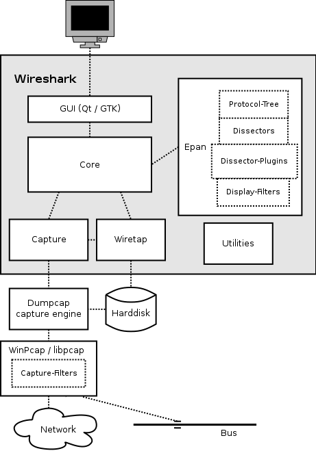

# Wireshark #

## wireshark 整体架构 #

### 架构图 #

### 模块功能 #

- GUI
    - 处理所有的用户输入/输出(所有的窗口,对话框等等)
    - 源代码目录/ui，GTK（/ui/gtk），Qt（/ui/qt）
- Core
    - 主要的"粘合代码"(glue code),它把其他的块组合到一起
    - 源代码目录/
- Epan
    - Ethereal Packet Analyzer，数据包解析引擎
    - 源代码目录/epan
    - 包括如下API
        - 协议树(Protocol-Tree)
            - 保存捕获文件的协议信息数据
            - 源代码目录/epan
        - 解析器(Dissectors)
            - 多种协议的解析器
            - 源代码目录/epan/dissectors
        - 插件(Plugins)
            - 用插件实现的协议解析器
            - 源代码目录/plugins
        - 显示过滤器(Display-Filters)
            - 显示过滤器引擎
            - 源代码目录/epan/dfilter
- Wiretap
    - 读/写libpcap格式或者其他文件格式的数据包文件
    - 源代码目录/wiretap
- Capture
    - 抓包引擎相关接口
    - 源代码目录/
- Dumpcap
    - 抓包引擎. 这是唯一需要提升权限来执行的部分
    - 源代码目录/
- WinPcap and libpcap
    - 依赖于平台的包捕获库,包含捕获过滤器引擎

### 主要调用关系 #

## 参考 #

[wireshark官方文档](https://www.wireshark.org/docs/wsdg_html_chunked/ChWorksOverview.html)